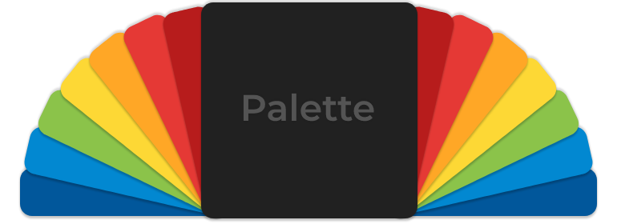

<p align="center" >
  
</p>

[](https://travis-ci.com/Shade-Zepheri/Palette)
[](https://github.com/Shade-Zepheri/Palette/releases/latest)

[](LICENSE)
[](https://swift.org/package-manager/)
[](https://twitter.com/alfonso_gonzo)

Fetch the three most prominent colors in an image.

## Requirements

- iOS 10.0+ | macOS 10.12+ (10.15 for Catalyst) | tvOS 10.0+
- Xcode 11.0+ (For Swift Package Manager)

## Integration

### Swift Package Manager (Xcode 11+)

Palette utilizes [Swift Package Manager](https://swift.org/package-manager/) as the main means for distribution.

To add Palette to your project, select `File` -> `Swift Packages` -> `Add Package Dependency` and enter [Palette's repo's URL](https://github.com/Shade-Zepheri/Palette.git). Alternatively, you can add your GitHub account to Xcode and search for `Palette`.

### Manually

To manually install, simply copy [Palette.swift](Sources/Palette/Palette.swift) into your project.

## How To Use

A simplified overview:
```swift
let image = UIImage(named: "thing1.png")

image.retrieveColorPalette { palette in
    backgroundView.backgroundColor = palette.primary
    mainLabel.textColor = palette.secondary
    secondaryLabel.textColor = palette.tertiary
}
```

Palette also provides a synchronous method call
```swift
public func retrieveColorPalette(quality: UIImageResizeQuality = .standard) -> UIImageColorPalette?
```

Both the async and sync methods can take an optional `UIImageResizeQuality` parameter that resizes the image in order to improve performance.

## License

Palette is licensed under the [MIT License](LICENSE).
